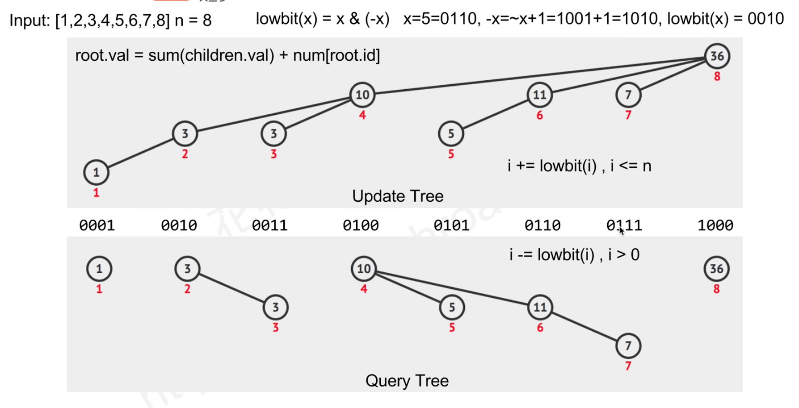

# 1.立意

记录一些我了解的高级数据结构；

## 2.树形数组

首先，它是一个数组，而其中的元素之间是有父子关系的——准确讲是前驱关系，因为结点可以有多个父节点，不对，是多个前驱节点。

首先来熟悉一个操作，lowbit(x) = x&(-x)。它能找到只有x的最右边的1组成的二进制数。比如下面这张表

x | 1 | 2 | 3 | 4 | 5 | 6 | 7 | 8 | 9 | 10 | 11 | 12 | 13 | 14 | 15 | 16
--- | --- | --- | --- | --- | ---| --- | --- | --- | --- | --- | --- | --- | --- | --- | --- | ---
binary | 1 | 10 | 11 | 100 | 101 | 110 | 111 | 1000 | 1001 | 1010 | 1011 | 1100 | 1101 | 1110 | 1111 | 10000
lowbit(x) | 1 | 2 | 1 | 4 | 1 | 2 | 1 | 8 | 1 | 2 | 1 | 4 | 1 | 2 | 1 | 16

1. 查找
    1. 查找的是a1，a2，a3...,an的和；
2. 添加
    1. 添加时会更新当前节点的额所有前驱
3. 个人理解
    1. tree[n]中存放的不一定是sum(a1,a2,...,an)，sum(a1,a2,...,an)是通过查找操作获取的
    2. 树形数组其实是一种前缀思想，但是它的威力不在于普普通通的求和，而是在于不断更新中的求和。

## 3. 线段树

线段树是用于对一维数组做各个区间(也是子数组)的一个聚合运算，比如sum、max、min等；其在支持更新数组的基础值方面 效果显著。

1. 看过花花酱的视频，并写了 `study.erik.algorithm.ds.SegmentTree`。该写法是基于树节点的。
2. 在《算法竞赛》数中，有用完全二叉树的形式来组织该数，比较巧妙。
3. 在《算法竞赛》中，对线段树的应用是，求区间中的第k个小的数。
4. 线段树不仅支持对arr中一个值的更新，也可以支持对arr中某个区间的统一更新，比如统一增加delta. \n 这个玩法我们也实现了，参加类`study.erik.algorithm.ds.SegmentTree2`.
   关于线段树的区间修改，《算法竞赛》讲的很清楚了，同时这篇帖子`https://blog.csdn.net/csyifanZhang/article/details/105187309`
   指出了线段树的使用局限——结合律。还指出分块思想，而线段树算是一种分法的应用.
5.

## 4.并查集

1. 经典题目：

### 1.算法说明

并查集，就是合并连通分量

### 2.经典代码分析

经典代码片段如(src/main/java/study/erik/algorithm/ds/advance/UnionFindSet.java)

## 5.FenwickTree 或者叫做 BinaryIndexTree

介绍：用这个结构来求preSum的。代码如下

```java
private static class Tree {
    private int[] s;

    public Tree(int[] nums) {
        s = new int[nums.length + 1];
    }

    /**
     * index = (nums的i)+1
     *
     * @param index s中的index
     * @param delta 相对已原数组data[i]的delta.
     */
    public void update(int index, int delta) {
        while (index < s.length) {
            s[index] += delta;
            index += lowBit(index);
        }
    }

    /**
     * 查询前缀和，相对于原数组nums，不包含i；
     *
     * @param i
     * @return
     */
    public int queryPreSum(int i) {
        int preSum = 0;
        while (i > 0) {
            preSum += s[i];
            i -= lowBit(i);
        }
        return preSum;
    }

    private int lowBit(int x) {
        return x & (-x);
    }
}

```

pic: 

代码是相当的简单好记，但是内容还是需要理解的。

1. s[i] 存的是什么：比如
    1. s[8] = a[8] + s[7] + s[6] + s[4]
    2. s[7] = s[7] = a[7]
    3. s[6] = a[6] + s[5]
    4. s[4] = s[2] + s[3]
    5. s[3] = s[3] = a[3]
    6. s[2] = a[2] + s[1]
    7. s[1] = a[1]
    8. 所以s[i]存的是什么呢？假设i=11000，则s[i]存的是i的末尾0上所有的index的和+本位值，如果末尾0是000，则代表【1,2,3,4,5,6,7】+本位值
2. 为什么`s[8] = a[8] + s[7] + s[6] + s[4]` ，因为7+lowbit(7)、6+lowbit(6)、4+lowbit(4)都是8 这是update的过程。
3. 查询presum时，考虑presum(8)和presum(7)两个过程。7-lowbit(7) = 6; 6-lowbit(6) = 4; 4-lowbit(4)=0;

#### 有三种问法
1. 点更新问区间和
2. 区间更新，问点值
3. 区间更新，问区间合
#### 具体题目：

8. medium `307. Range Sum Query - Mutable`